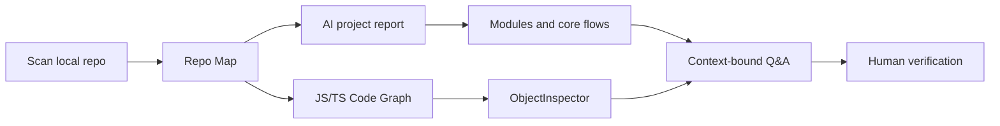
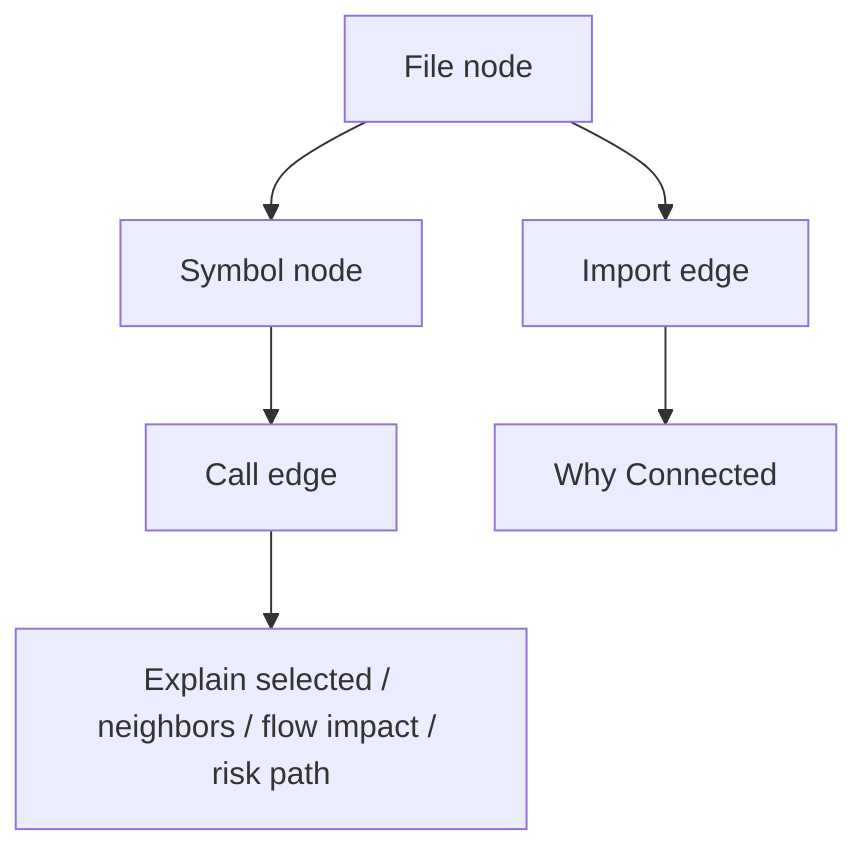
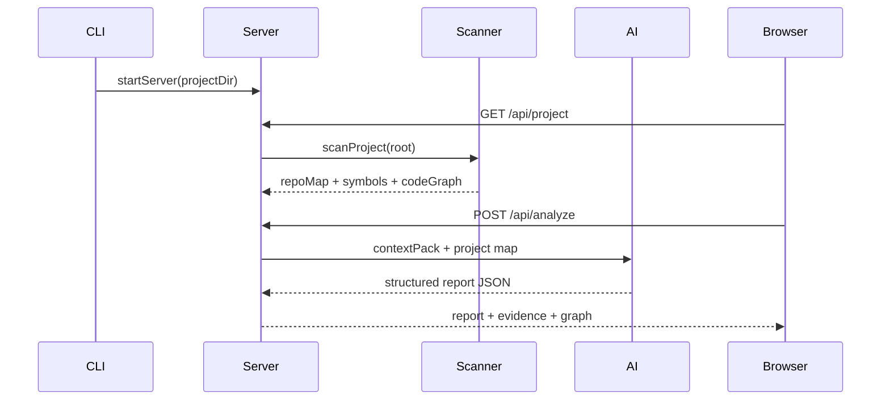

<p align="center">
  
</p>

# codemap-ai

<p align="center">
  把本地代码仓库转成可验证的项目接管地图。
</p>

<p align="center">
  <a href="https://www.npmjs.com/package/@codemapai/codemap-ai">npm package</a> |
  <a href="./docs/brand.md">Brand</a> |
  <a href="./docs/开发计划.md">Roadmap</a> |
  <a href="https://github.com/weimin96/codemap-ai/issues">Issues</a> |
  <a href="./LICENSE">License</a>
</p>

<p align="center">
  <a href="https://www.npmjs.com/package/@codemapai/codemap-ai"></a>
  <a href="https://www.npmjs.com/package/@codemapai/codemap-ai"></a>
  <a href="https://github.com/weimin96/codemap-ai/actions/workflows/ci.yml"></a>
  <a href="./LICENSE"></a>
  <a href="https://nodejs.org"></a>
</p>

codemap-ai 是一个本地 AI 项目接管工作台。它扫描指定目录，生成项目总览、模块地图、核心链路、数据模型、风险雷达、代码证据和 JS/TS Code Graph，并把追问绑定到当前文件、选区、符号、链路或风险。

npm 包名为 `@codemapai/codemap-ai`。主 CLI 是 `codemap-ai`。

## Table of content

- [About](#about)
- [Examples](#examples)
- [Installation](#installation)
- [Usage](#usage)
- [AI providers](#ai-providers)
- [Workbench](#workbench)
- [How it works](#how-it-works)
- [Export](#export)
- [Development](#development)
- [Release](#release)
- [Security and local data](#security-and-local-data)
- [Current limits](#current-limits)

## About

大型项目经过多轮 AI 修改后，接手人通常需要先搞清楚入口、模块边界、核心流程、数据读写和风险点。codemap-ai 的目标不是替代人工审查，而是先生成一版可以验证的项目地图，让阅读顺序、代码证据和后续追问有明确上下文。

codemap-ai 当前版本为 `0.2.0`，核心能力包括：

- 本地目录扫描、入口识别、模块候选和 Repo Map。
- AI 项目报告：总览、模块、链路、数据模型、风险、阅读路线和证据索引。
- JS/TS Code Graph：文件、目录、符号、导入、近似调用关系和解析 warning。
- Cytoscape 图谱画布：范围切换、边过滤、warnings-only、邻居高亮、2-hop 影响范围和 Why Connected。
- ObjectInspector：围绕图谱节点展示概览、解释、为什么有关、告警和代码。
- Graph-aware Context Pack：按模块、链路、风险、路径、符号和图谱邻居加权选择 AI 上下文。
- 结构化追问：结论、证据、风险、下一步验证、相关文件和可信度。
- 接管文档导出：项目地图、模块、核心链路、数据模型、风险登记、阅读计划、问题清单、图谱摘要和分析质量。

## Examples

### Start a local workspace

```bash
codemap-ai /path/to/your/project
```

默认会打开：

```text
http://127.0.0.1:3000
```

### Read a project through evidence



### Ask questions with scoped context

```text
当前文件：server/server.js
选中代码：/api/analyze 路由
问题：这个接口失败时会不会吞掉 AI JSON 解析错误？
```

codemap-ai 会把当前文件、选区、符号、链路、风险和相关图谱邻居放入上下文，再返回结构化答案。回答仍需要通过代码、断点、日志或测试验证。

### Inspect graph connections



Explain 不提供 Explain All，避免高成本批量推断和不可验证结论。当前支持 Explain selected、Explain neighbors、Explain current flow impact、Explain risk path。

## Installation

```bash
npm install -g @codemapai/codemap-ai
```

本地打包验证：

```bash
npm run pack:local
npm install -g ./codemapai-codemap-ai-0.2.0.tgz
```

## Usage

启动当前目录：

```bash
codemap-ai .
```

启动指定项目：

```bash
codemap-ai /path/to/your/project
```

指定端口：

```bash
codemap-ai /path/to/your/project --port 8088
```

不自动打开浏览器：

```bash
codemap-ai /path/to/your/project --no-open
```

无 UI 生成上下文包：

```bash
codemap-ai pack /path/to/your/project --format markdown -o context.md
codemap-ai pack https://github.com/org/repo --format markdown -o context.md
codemap-ai pack /path/to/your/project --format json -o context.json
codemap-ai pack /path/to/your/project --format xml -o context.xml
codemap-ai pack /path/to/your/project --include src/** --ignore **/*.test.ts -o context.md
git ls-files | codemap-ai pack /path/to/your/project --stdin -o context.md
codemap-ai pack /path/to/your/project --include-diffs --include-logs -o context.md
codemap-ai pack /path/to/your/project --max-files 5000 --max-depth 6 --max-bytes-total 200000000 -o context.md
```

`pack` 会输出 Repo Map、Graph-aware Context Pack、已选文件片段和跳过原因，适合与其他 CLI 或 AI 工具串联。输入为 Git URL 时会浅克隆到临时目录，生成完成后自动清理。`--include`、`--ignore` 和 `--stdin` 只影响 pack 输出，不改变 Web UI 的项目扫描。`--include-diffs` 会附加当前 Git diff，`--include-logs` 会附加最近 20 条提交摘要。`--max-files`、`--max-depth` 和 `--max-bytes-total` 可限制大仓库扫描范围。

## AI providers

打开页面右上角的 AI 设置，填写 Provider、Base URL、Model 和 API Key。

配置优先级：CLI 参数 / 项目配置 > `codemap-ai.config.json` > 环境变量 > Web UI 保存配置。

### OpenAI-compatible

```text
Provider: OpenAI Compatible
Base URL: https://api.openai.com/v1
Model: gpt-4.1-mini 或其他模型
API Key: sk-...
```

环境变量示例：

```bash
OPENAI_API_KEY=xxx OPENAI_MODEL=gpt-4.1-mini codemap-ai /path/to/project
```

### Ollama

```bash
ollama serve
ollama pull qwen2.5-coder:7b
```

页面配置：

```text
Provider: Ollama
Base URL: http://127.0.0.1:11434/api
Model: qwen2.5-coder:7b
API Key: 留空
```

codemap-ai 也支持 OpenAI、OpenRouter、DeepSeek、Kimi、智谱、SiliconFlow 和 Auto fallback。Auto fallback 默认按 `ollama,openai-compatible,openrouter,openai` 顺序尝试，可通过 `CODEMAP_AI_PROVIDER_PRIORITY` 覆盖。

## Workbench

| 页面 | 用途 |
|---|---|
| 项目总览 | 查看项目定位、技术栈、启动方式、模块数、链路数、风险数和分析质量。 |
| 模块地图 | 按业务模块组织结构，查看职责、入口、依赖、实体、链路、风险和证据。 |
| 核心链路 | 查看链路图、步骤、代码剧本、数据读写、外部调用、异常路径和推荐断点。 |
| 数据模型 | 查看实体、关系、状态机、关键字段和数据风险。 |
| 风险雷达 | 查看风险分布、影响范围、验证步骤、建议测试和相关文件。 |
| 代码图谱 | 查看 JS/TS 文件、目录、符号、导入和近似调用关系。 |
| 代码浏览器 | 打开证据文件、定位符号和行号，并结合右侧追问面板分析代码。 |
| 追问历史 / 阅读路线 | 查看报告生成的阅读计划和按 scope 归档的追问历史。 |

分析质量会显示未解析 import、未解析 call、parse error 和跳过大文件，避免把不完整图谱误当成确定结论。

## How it works



服务端运行在本机，扫描结果、报告、追问历史和图谱缓存优先保存在内存中。在支持 `node:sqlite` 的 Node 运行时，会镜像写入本地 SQLite：scan runs、reports、chat threads、verified conclusions、code graph、explain cache 表。

## Export

```bash
# Repo Map
curl http://127.0.0.1:3000/api/repo-map

# Context Pack
curl http://127.0.0.1:3000/api/context-pack?format=markdown

# 接管文档集 API
curl http://127.0.0.1:3000/api/onboarding-docs
```

也可以在系统顶部点击“接管文档”，下载 `codemap-ai-onboarding-docs.zip`。文档集包含：`PROJECT_MAP.md`、`MODULES.md`、`CORE_FLOWS.md`、`DATA_MODEL.md`、`RISK_REGISTER.md`、`READING_PLAN.md`、`QUESTIONS.md`、`CODE_GRAPH_SUMMARY.md`、`ANALYSIS_QUALITY.md`。

## Development

```bash
npm run dev          # 启动本地工作台
npm run typecheck    # 前端 TypeScript 类型检查
npm run test         # 服务端单元测试
npm run build        # Vite 前端生产构建
npm run lint         # ESLint 静态检查
npm run pack:local   # 本地 npm pack
```

项目结构：

```text
bin/codemap-ai.js             CLI entry
server/server.js              Express routes and Vite middleware
server/scanner.js             file walker and repo map input
server/symbol-indexer.js      regex-based symbol extraction
server/ai.js                  AI SDK wrapper and JSON parsing
server/context-pack.js        context selection for AI
server/repo-map.js            file ranking and module grouping
web/                          Vite + React + TypeScript UI
web/public/brand/             codemap-ai logo
```

发布前会执行：

```bash
npm run typecheck && npm run test && npm run build
```

## Release

仓库提供 GitHub Actions：PR 和 main 分支 push 会执行依赖安装、类型检查、测试和构建；main 分支还会执行 `npm pack --dry-run`。

Release workflow 通过 npm Trusted Publishing 发布，不需要在仓库配置 npm token。发布前需要确保 npm 包侧 Trusted Publisher 精确匹配 GitHub user/org、repository 和 workflow filename。

## Security and local data

API Key 优先通过环境变量提供。通过页面保存时，配置写入本机用户目录 `~/.codemap-ai/config.json`。

本地保存的 API Key 会使用 Node.js `crypto` 进行 AES-256-GCM 加密，密钥保存在同一配置目录下的本地密钥文件中。该方案用于避免配置文件直接出现明文 API Key；如果攻击者已经获得同一系统用户的文件读取权限，仍可能同时读取密文和密钥文件。

codemap-ai 会把你选择的项目上下文发送给配置的 AI provider。不要对不可信 provider 发送敏感代码或凭证。

## Current limits

- 符号索引当前使用正则实现，不是 Tree-sitter AST 级索引。
- Code Graph 目前只支持 JS/TS 图谱层；Python / Go / Java 仍只有符号索引。
- `calls` 使用 TypeScript AST CallExpression 提取，但目标解析仍基于名称匹配，无法覆盖动态调用、别名、重导出和复杂类型推断。
- 核心链路仍是候选链路，不是完整精确调用图。
- Context Pack 使用字符预算近似 token 预算。
- Graph-aware Context Pack 会使用 Code Graph 邻居和 warning 加权，但仍不是完整本地 RAG 或类型系统级调用图。
- SQLite 镜像持久化依赖运行时支持 `node:sqlite`；Node 20 环境会自动跳过，不阻断主流程。
- 多模型 fallback 已支持 `provider=auto`，但每个 provider 的独立 API Key / model UI 尚未展开。
- 暂未支持多人协作或远程仓库托管。
