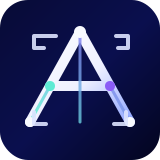

<p align="center">
  
</p>

<p align="center">
  
</p>

# CodeAtlas

本地项目快速接管工作台。通过 npm 安装后，用命令指定一个本地项目目录，在浏览器里查看项目总览、模块地图、模块详情、核心链路、链路详情、数据模型、风险雷达、代码图谱、代码证据，并基于当前文件、选中代码、符号、链路或风险追问 AI。

> npm 包名当前仍沿用 `project-fast-onboarding`；CLI 已新增 `codeatlas`，并保留 `pfo` / `project-fast-onboarding` 兼容入口。

## 当前版本

当前代码版本：`0.5.1`。

已完成能力覆盖 v0.1-v0.5，并继续补充项目理解工作台能力：顶部导航、CodeAtlas 品牌字标和 logo、报告质量信息、证据索引、模块详情、链路剧本、风险详情、Graph-aware Context Pack、结构化追问答案、明确失败策略、JS/TS Code Graph、Cytoscape 图谱、图谱 Inspector、AI Explain cache、AI JSON repair、人工确认状态字段、测试脚本、CI 和 zip 接管文档导出。

## 品牌资源

- 字标：`web/public/brand/codeatlas-wordmark.svg`
- Logo：`web/public/brand/codeatlas-logo.svg`
- 系统复用组件：`web/src/components/BrandMark.tsx`
- 品牌使用说明：`docs/brand.md`
- 浏览器 favicon 和系统顶部品牌区已使用该 logo。
- 字标为纯 SVG 几何笔画，不依赖外部字体。

## 技术栈

- CLI / Server: Node.js + Express
- Frontend: Vite + React + TypeScript
- UI: Tailwind CSS + shadcn/ui 风格组件
- Icons: lucide-react
- Diagram: Mermaid
- Code graph visualization: Cytoscape
- Code Preview: Monaco Editor via `@monaco-editor/react`
- AI: Vercel AI SDK (`ai`)
  - OpenAI: `@ai-sdk/openai`
  - OpenAI-compatible: `@ai-sdk/openai-compatible`
  - Ollama: `ollama-ai-provider-v2`
- Schema validation: Zod
- Test: Node.js built-in test runner

## 安装

```bash
npm install -g ./project-fast-onboarding-0.5.1.tgz
```

或者发布到 npm 后：

```bash
npm install -g project-fast-onboarding
```

## 使用

```bash
codeatlas /path/to/your/project
```

指定端口：

```bash
codeatlas /path/to/your/project --port 8088
```

不自动打开浏览器：

```bash
codeatlas /path/to/your/project --no-open
```

默认地址：

```text
http://127.0.0.1:7890
```

## 开发与验证

```bash
npm run dev          # 启动本地工作台
npm run typecheck    # 前端 TypeScript 类型检查
npm run test         # 服务端单元测试
npm run build        # Vite 前端生产构建
npm run lint         # ESLint 静态检查
npm run pack:local   # 本地 npm pack
```

发布前会执行：

```bash
npm run typecheck && npm run test && npm run build
```

仓库已提供 GitHub Actions：PR 和 main 分支 push 会执行依赖安装、类型检查、测试和构建；main 分支还会执行 `npm pack --dry-run`。

## AI 配置

打开页面右上角的 AI 设置，填写 Provider、Base URL、Model 和 API Key。

配置优先级：CLI 参数 / 项目配置 > `pfo.config.json` > 环境变量 > Web UI 保存配置。

### OpenAI-compatible

```text
Provider: OpenAI Compatible
Base URL: https://api.openai.com/v1
Model: gpt-4.1-mini 或其他模型
API Key: sk-...
```

也支持环境变量：

```bash
OPENAI_API_KEY=xxx OPENAI_MODEL=gpt-4.1-mini codeatlas /path/to/project
```

### Ollama

```bash
ollama serve
ollama pull qwen2.5-coder:7b
```

页面填写：

```text
Provider: Ollama
Base URL: http://127.0.0.1:11434/api
Model: qwen2.5-coder:7b
API Key: 留空
```

## 工作台页面

- 项目总览：项目定位、技术栈、启动方式、模块数、链路数、风险数和分析质量。
- 模块地图：按业务模块组织项目结构，进入模块详情查看职责、能力、入口、依赖、数据实体、相关链路、风险和代码证据。
- 核心链路：查看链路图和步骤，进入链路详情查看时序图、代码剧本、数据读写、外部调用、异常路径、推荐断点、风险和证据。
- 数据模型：查看实体、关系、状态机、关键字段和数据风险。
- 风险雷达：查看风险分布，选择风险后查看影响范围、验证步骤、建议测试和代码证据。
- 代码图谱：查看 JS/TS 文件、目录、符号、导入和近似调用关系，支持范围切换、边过滤、按文件/函数/模块/warning 搜索、warnings-only、邻居高亮、2-hop 影响范围、业务回链和 Why Connected 最短路径。
- 代码浏览器：打开证据文件、定位符号和行号，结合右侧追问面板分析代码。
- 追问历史 / 阅读路线：查看报告生成的阅读计划。

## 当前能力

- 扫描本地项目目录，并识别关键文件、入口候选、模块候选。
- 基于正则提取 JavaScript / TypeScript / Python / Go / Java 的函数、类、接口、方法和常量。
- 构建 Repo Map，并按优先级、路径角色、符号数量和文件大小排序。
- 构建 JS/TS Code Graph，输出 nodes、edges、warnings，边类型包含 `contains`、`defines`、`imports`、`calls`。
- Code Graph 使用 TypeScript AST 提取 JS/TS imports、exports、require、动态 import 和 CallExpression，再进行本地符号匹配。
- 图谱页支持 Cytoscape 交互画布和 Inspector：概览、解释、为什么有关、告警、代码。
- Inspector 解释 tab 使用 600ms 延迟触发、切换取消和前端 session cache；服务端会先查 SQLite explain_cache，未命中才请求 AI，成功后写入缓存。
- Why Connected 通过最短路径解释两个节点为什么有关。
- 构建 Context Pack，按字符预算选择 AI 分析上下文，并支持导出 `project-context.md`。
- Context Pack 支持 `overview`、`module`、`flow`、`risk`、`question` mode，并按目标模块、链路、风险、路径、符号和 Code Graph 邻居加权选择上下文。
- AI 生成项目概览、分析质量、入口、模块、模块能力、核心链路、数据模型、风险、阅读路线、证据索引和 Mermaid 图。
- AI 分析 prompt 按项目总览、模块分析、链路分析、风险与待验证问题四阶段组织。
- AI 返回非法 JSON 时会用 repair prompt 重试一次；重试后仍失败才显示错误。
- 启发式生成 2-5 条核心链路候选，包括 CLI、API、页面和后台任务等常见入口。
- 链路步骤可绑定文件、符号和行号，并支持点击打开代码位置。
- 模块详情和链路详情会把判断连接到代码证据。
- 风险详情包含风险说明、影响范围、验证步骤、建议测试和相关文件。
- 模块、链路、风险和数据实体已有人工确认状态字段：`ai_guess`、`verified`、`rejected`、`pending`、`stale`。
- 模块详情、链路详情和风险详情支持更新确认状态，并通过 `/api/verification` 写回本地报告文件。
- 追问会绑定当前文件、选中行、当前符号、当前链路和当前风险。
- 追问返回结构化答案：结论、证据、风险、下一步验证动作、相关文件和可信度。
- 追问历史会按 scope 归档到浏览器 localStorage，包括项目、链路、风险、文件、符号和选区。
- 在支持 `node:sqlite` 的 Node 运行时，会镜像写入本地 SQLite：scan runs、reports、chat threads、verified conclusions、code graph、explain cache 表。
- 支持导出 `repo-map.json`、`project-context.md` 和 `/api/onboarding-docs` 接管文档集。
- 系统顶部“接管文档”按钮会下载 `codeatlas-onboarding-docs.zip` 多文件文档集。
- `/api/onboarding-docs` 返回 `PROJECT_MAP.md`、`MODULES.md`、`CORE_FLOWS.md`、`DATA_MODEL.md`、`RISK_REGISTER.md`、`READING_PLAN.md`、`QUESTIONS.md`、`CODE_GRAPH_SUMMARY.md`、`ANALYSIS_QUALITY.md`。
- 支持 OpenAI-compatible、OpenAI、OpenRouter、DeepSeek、Kimi、智谱、SiliconFlow、Ollama 和 Auto fallback。
- Auto fallback 会按 `ollama,openai-compatible,openrouter,openai` 顺序尝试；可通过 `PFO_AI_PROVIDER_PRIORITY` 覆盖。

## 明确失败策略

系统不把关键错误降级成可继续结果：

- AI 分析和追问必须返回合法 JSON；非法 JSON 只 repair 一次。
- AI repair 后仍不是合法 JSON，或追问结果字段结构不符合要求时，请求会失败并显示错误。
- Context Pack、追问上下文和扫描器读取文件失败时会明确报错。
- `.gitignore` / `pfo.ignore` 只在文件不存在时忽略；其他 IO 错误会中止扫描。
- 配置文件不存在时使用环境变量；配置文件存在但读取失败、JSON 不合法或解密失败时会明确报错。
- 前端 API 请求统一校验 HTTP 状态和响应中的 `error` 字段，配置加载失败不会被静默忽略。

## 导出

```bash
# Repo Map
curl http://127.0.0.1:7890/api/repo-map

# Context Pack
curl http://127.0.0.1:7890/api/context-pack?format=markdown

# 接管文档集 API
curl http://127.0.0.1:7890/api/onboarding-docs

# 或在系统顶部点击“接管文档”，下载 codeatlas-onboarding-docs.zip
```

接管文档集 API 以 JSON 返回多个 Markdown 文件名和内容；前端会打包为 zip，适合放入项目仓库或团队交接目录。

## 设计取向

这个工具不是普通 AI coding assistant，而是“项目接管工作台”：

1. 先生成第一版地图。
2. 再进入模块或链路详情，查看职责、剧本和证据。
3. 然后通过代码图谱检查真实导入、近似调用关系、范围过滤、邻居高亮、业务回链和解析告警。
4. 接着围绕当前文件、函数、链路或风险追问。
5. 最后由人基于代码、断点、日志和测试验证。

## 安全说明

API Key 优先可通过环境变量提供。通过页面保存时，配置写入本机用户目录 `~/.project-fast-onboarding/config.json`。

本地保存的 API Key 会使用 Node.js `crypto` 进行 AES-256-GCM 加密，密钥保存在同一配置目录下的本地密钥文件中。该方案用于避免配置文件直接出现明文 API Key；如果攻击者已经获得同一系统用户的文件读取权限，仍可能同时读取密文和密钥文件。

## 当前限制

- 产品展示名、README 标题、系统顶部品牌和主 CLI 已统一为 CodeAtlas；npm 包名仍保留 `project-fast-onboarding`，尚未迁移。
- 符号索引当前使用正则实现，不是 Tree-sitter AST 级索引。
- Code Graph 目前只支持 JS/TS 图谱层；Python / Go / Java 仍只有符号索引。
- `calls` 已改为 TypeScript AST CallExpression 提取，但目标解析仍基于名称匹配，无法覆盖动态调用、别名、重导出和复杂类型推断。
- 核心链路仍是候选链路，不是完整精确调用图。
- Context Pack 使用字符预算近似 token 预算。
- Graph-aware Context Pack 会使用 Code Graph 邻居和 warning 加权，但仍不是完整本地 RAG 或类型系统级调用图。
- 模块、链路、风险和数据实体的人工确认状态已支持 UI 更新并写回本地报告。
- SQLite 镜像持久化依赖运行时支持 `node:sqlite`；Node 20 环境会自动跳过，不阻断主流程。
- `/api/onboarding-docs` 已提供前端合并 Markdown 下载；暂未提供 zip 批量下载。
- `test:e2e` 已接入 Playwright，包含工作台 smoke 用例；CI 会安装 Chromium 后执行。
- `lint` 已接入 ESLint；当前关闭了 `preserve-caught-error` 和 `no-useless-escape`，避免把既有错误包装和正则写法变成大范围重构。
- release workflow 已提供 npm provenance 发布入口，但真实发布依赖仓库配置 `NPM_TOKEN`。
- 多模型 fallback 已支持 `provider=auto`，但每个 provider 的独立 API Key / model UI 尚未展开。
- 暂未支持多人协作或远程仓库托管。

下一版建议：npm 包名迁移、TypeScript 类型系统级调用解析、更完整 Playwright 关键路径测试、SQLite 查询 UI、多人协作。
